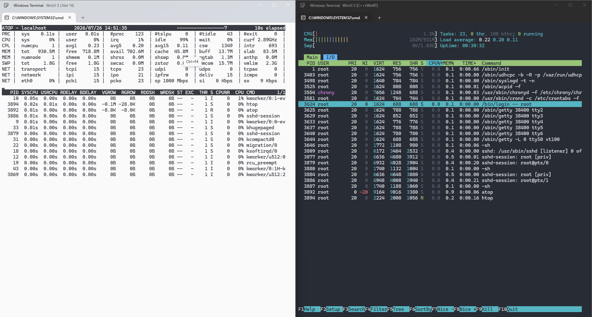

# XamlToolkit.WinUI.Terminal

Embed **Windows Terminal** as a native XAML control in your WinUI 3 / Windows App SDK applications.

This project wraps the official [`TermControl`](https://github.com/microsoft/terminal) from Windows Terminal into a reusable NuGet package, with first-class support for both .NET (via CsWinRT) and C++/WinRT.

Based on Windows Terminal source code around **v1.25.1171.0**.

This project is part of [CommunityToolkit.WinUI](https://github.com/lgztx96/CommunityToolkit.WinUI).

## Features

- 🖥️ **Native `TermControl`** — Full terminal emulator as a WinUI 3 XAML control
- 🗂️ **Multi-tab support** — Host multiple terminal sessions in a `TabView`
- 🎨 **Theme support** — Light and dark themes with customizable color schemes (One Half Dark / One Half Light included)
- 📋 **Clipboard integration** — Copy/paste with plain text, HTML, and RTF format support
- ⌨️ **Customizable key bindings** — Override default shortcuts (Ctrl+C copy, Ctrl+V paste, etc.)
- 🔗 **Hyperlink detection** — Clickable links that open in the default browser
- 🏗️ **Multi-architecture** — Pre-built native DLLs for x64, x86, and ARM64
- 📦 **Dual API surface** — .NET managed wrapper and C++/WinRT native references

## Requirements

| | |
|---|---|
| **OS** | Windows 10 version 1809 (build 17763) or later |
| **SDK** | Windows App SDK 1.8 |
| **.NET** | .NET 8, 9, or 10 (for managed consumers) |
| **C++** | C++/WinRT 2.x (for native consumers) |

## Getting Started

Install the NuGet package, implement the settings interfaces (`IControlSettings`, `ICoreSettings`, `IControlAppearance`, `ICoreAppearance`, `ICoreScheme`), create a `ConptyConnection` for the shell, and add the `TermControl` to your UI. See the sample projects for complete working examples.

## Samples

Both sample applications demonstrate:

- Multi-tab terminal with `TabView`
- Real-time light/dark theme switching
- Clipboard copy (plain text, HTML, RTF) and paste
- Custom key bindings (Ctrl+C / Ctrl+V)
- Hyperlink detection and launching
- `DesktopAcrylicBackdrop` title bar integration
- Proper cleanup on tab/window close
